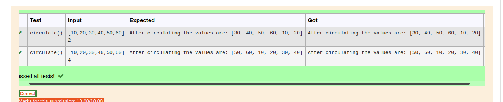

# Circulate-the-values-of-N-variables
## Aim:
To write a python program to circulate the n variables using function concept
## Equipment’s required:
PC
Anaconda - Python 3.7
## Algorithm: 
### Step 1: 
using a user defined function

### Step 2: 
take 2 variable for getting inputs

### Step 3: 
Get the value from the user for the number of rotation

### Step 4: 
Using the slicing concept rotate the list

### Step 5: 
use the slicing method to circulate the values

### Step 6: 
by taking variable a and print the varible

## Program:
``` python
#Program to circulate N values.
#Developed by: SAIRAJKUNAR T J
#RegisterNumber:22005240
def circulate():
    a=eval(input())
    n=int(input())
    a=a[n:]+a[:n]
    print("After circulating the values are:",a)

```

## Output:


## Result:
By the program we able to circulate the values of n variable
